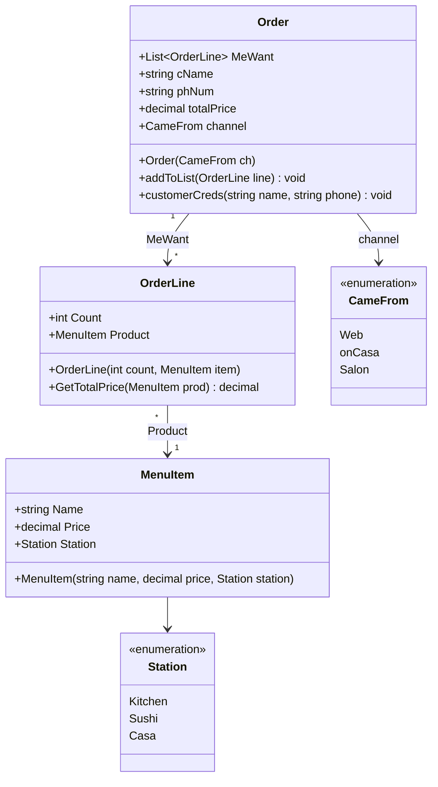
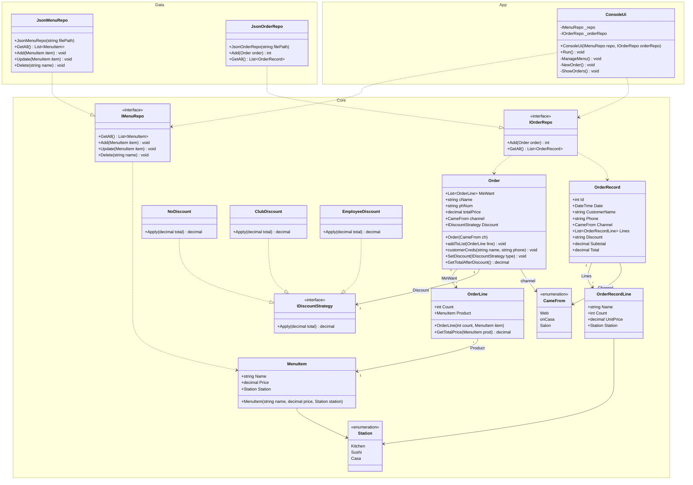

# Class diagrams

## Early version

```mermaid
classDiagram

    class MenuItem {
        +string Name
        +decimal Price
        +Station Station
        +MenuItem(string name, decimal price, Station station)
    }

    class OrderLine {
        +int Count
        +MenuItem Product
        +OrderLine(int count, MenuItem item)
        +GetTotalPrice(MenuItem prod) decimal
    }

    class Order {
        +List~OrderLine~ MeWant
        +string cName
        +string phNum
        +decimal totalPrice
        +CameFrom channel
        +Order(CameFrom ch)
        +addToList(OrderLine line) void
        +customerCreds(string name, string phone) void
    }

    class Station {
        <<enumeration>>
        Kitchen
        Sushi
        Casa
    }

    class CameFrom {
        <<enumeration>>
        Web
        onCasa
        Salon
    }

    Order "1" --> "*" OrderLine : MeWant
    OrderLine "*" --> "1" MenuItem : Product
    MenuItem --> Station
    Order --> CameFrom : channel
```

## Final version

Discounts became a Strategy, storage went behind Repository interfaces, and a UI layer appeared.

```mermaid
classDiagram

    namespace App {
        class ConsoleUi {
            -IMenuRepo _repo
            -IOrderRepo _orderRepo
            +ConsoleUi(IMenuRepo repo, IOrderRepo orderRepo)
            +Run() void
            -ManageMenu() void
            -NewOrder() void
            -ShowOrders() void
        }
    }

    namespace Core {
        class MenuItem {
            +string Name
            +decimal Price
            +Station Station
            +MenuItem(string name, decimal price, Station station)
        }

        class OrderLine {
            +int Count
            +MenuItem Product
            +OrderLine(int count, MenuItem item)
            +GetTotalPrice(MenuItem prod) decimal
        }

        class Order {
            +List~OrderLine~ MeWant
            +string cName
            +string phNum
            +decimal totalPrice
            +CameFrom channel
            +IDiscountStrategy Discount
            +Order(CameFrom ch)
            +addToList(OrderLine line) void
            +customerCreds(string name, string phone) void
            +SetDiscount(IDiscountStrategy type) void
            +GetTotalAfterDiscount() decimal
        }

        class Station {
            <<enumeration>>
            Kitchen
            Sushi
            Casa
        }

        class CameFrom {
            <<enumeration>>
            Web
            onCasa
            Salon
        }

        class IDiscountStrategy {
            <<interface>>
            +Apply(decimal total) decimal
        }

        class NoDiscount {
            +Apply(decimal total) decimal
        }

        class ClubDiscount {
            +Apply(decimal total) decimal
        }

        class EmployeeDiscount {
            +Apply(decimal total) decimal
        }

        class IMenuRepo {
            <<interface>>
            +GetAll() List~MenuItem~
            +Add(MenuItem item) void
            +Update(MenuItem item) void
            +Delete(string name) void
        }

        class IOrderRepo {
            <<interface>>
            +Add(Order order) int
            +GetAll() List~OrderRecord~
        }

        class OrderRecord {
            +int Id
            +DateTime Date
            +string CustomerName
            +string Phone
            +CameFrom Channel
            +List~OrderRecordLine~ Lines
            +string Discount
            +decimal Subtotal
            +decimal Total
        }

        class OrderRecordLine {
            +string Name
            +int Count
            +decimal UnitPrice
            +Station Station
        }
    }

    namespace Data {
        class JsonMenuRepo {
            +JsonMenuRepo(string filePath)
            +GetAll() List~MenuItem~
            +Add(MenuItem item) void
            +Update(MenuItem item) void
            +Delete(string name) void
        }

        class JsonOrderRepo {
            +JsonOrderRepo(string filePath)
            +Add(Order order) int
            +GetAll() List~OrderRecord~
        }
    }

    NoDiscount ..|> IDiscountStrategy
    ClubDiscount ..|> IDiscountStrategy
    EmployeeDiscount ..|> IDiscountStrategy
    JsonMenuRepo ..|> IMenuRepo
    JsonOrderRepo ..|> IOrderRepo

    Order "1" --> "*" OrderLine : MeWant
    OrderLine "*" --> "1" MenuItem : Product
    Order "1" --> "1" IDiscountStrategy : Discount
    OrderRecord "1" --> "*" OrderRecordLine : Lines
    MenuItem --> Station
    Order --> CameFrom : channel
    OrderRecord --> CameFrom : Channel
    OrderRecordLine --> Station

    ConsoleUi ..> IMenuRepo
    ConsoleUi ..> IOrderRepo
    IMenuRepo ..> MenuItem
    IOrderRepo ..> Order
    IOrderRepo ..> OrderRecord
```