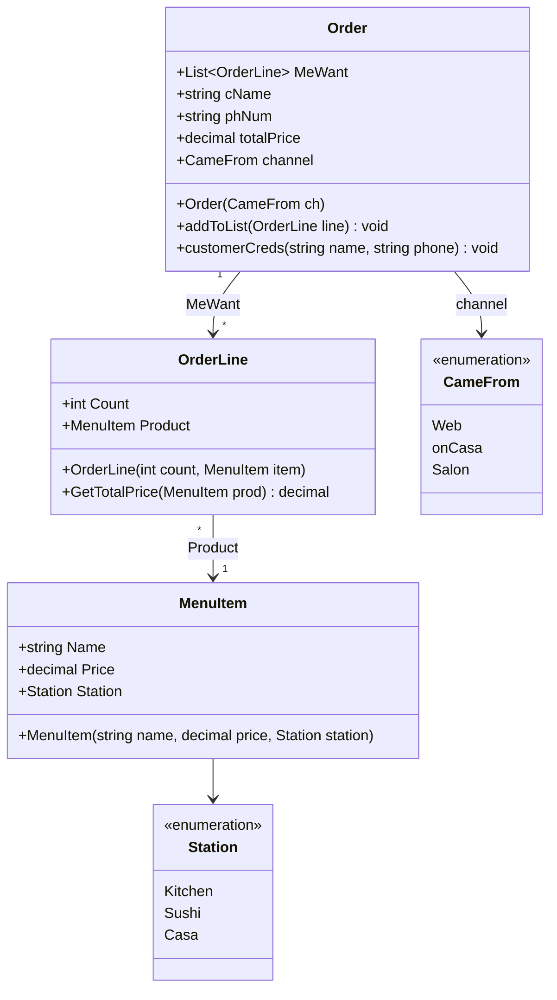

```mermaid
classDiagram

    class MenuItem {
        +string Name
        +decimal Price
        +Station Station
        +MenuItem(string name, decimal price, Station station)
    }

    class OrderLine {
        +int Count
        +MenuItem Product
        +OrderLine(int count, MenuItem item)
        +GetTotalPrice(MenuItem prod) decimal
    }

    class Order {
        +List~OrderLine~ MeWant
        +string cName
        +string phNum
        +decimal totalPrice
        +CameFrom channel
        +Order(CameFrom ch)
        +addToList(OrderLine line) void
        +customerCreds(string name, string phone) void
    }

    class Station {
        <<enumeration>>
        Kitchen
        Sushi
        Casa
    }

    class CameFrom {
        <<enumeration>>
        Web
        onCasa
        Salon
    }

    Order "1" --> "*" OrderLine : MeWant
    OrderLine "*" --> "1" MenuItem : Product
    MenuItem --> Station
    Order --> CameFrom : channel
```